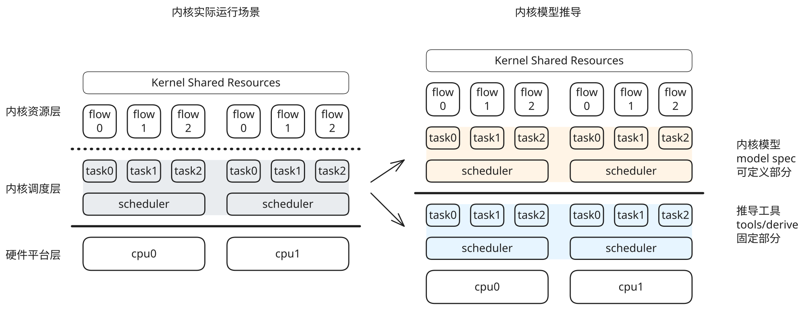
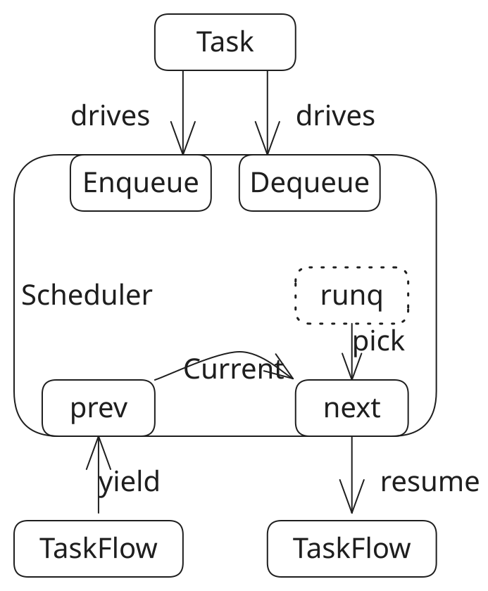

# 推导工具基本原理

推导工具本质是为内核模型提供了并发运行环境。可以与内核的实际运行进行一个对比：

模型推导是对内核实际运行过程的简化，可以忽略细枝末节，只关注最核心和最关键的内核并发行为。

模型推导由两层构成：

1. 建模语言描述的内核模型

   内核模型对应内核中的抽象概念，包括任务模型、任务执行流模型以及**调度器**模型，它们构成了内核并发的主体。注意，这个调度器模型是调度器前端，它需要与推导工具提供的调度器后端机制配合。

2. 推导工具内置的推导机制

   推导工具产生若干独立的推导线路，每条线路对应于实际环境中的一个**CPU**；每条线路恰有一个 CPU-owned **Scheduler** 和一个线路级只读 `CurrentTaskRef`。Scheduler 只维护 idle/runq 和调度策略，推导器负责 current、候选分支隔离和切换提交。当前实现仅构造 CPU0 单线路，要求模型恰有一个 sched_core 实例；未来 SMP 必须按 CPU 建立独立线路和独立 Scheduler。推导的起点是外部信号，包括开机启动信号和环境信号，前者是推导的原始推动力，后者将以中断信号的形式触发推导的临时分支路径。

# 调度器的抽象

XXX
